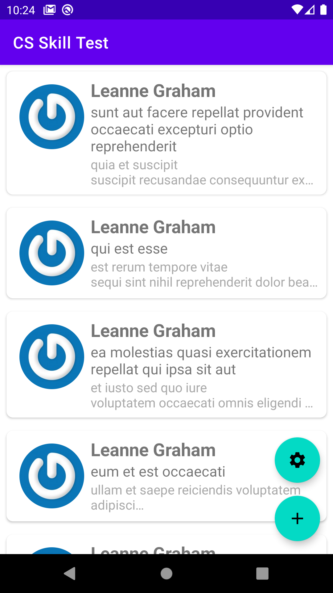
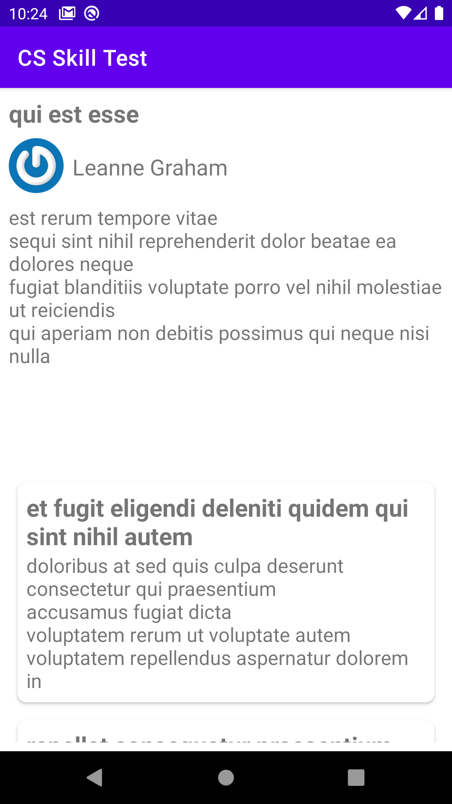
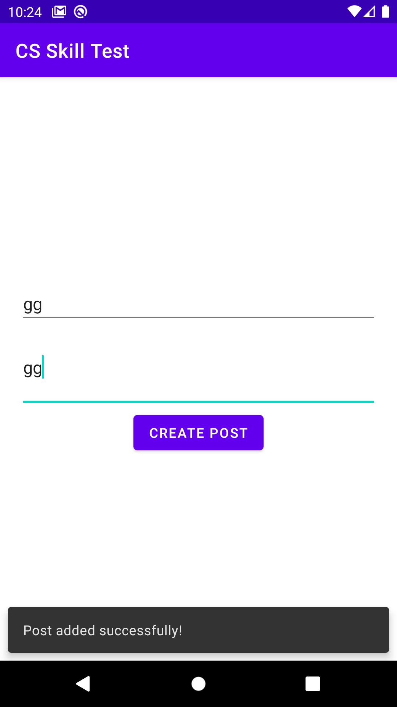
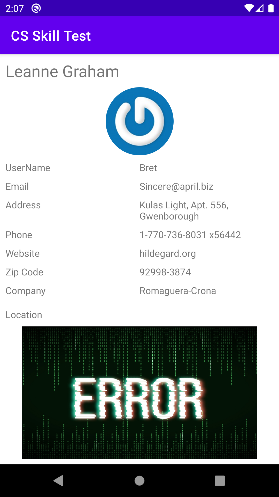
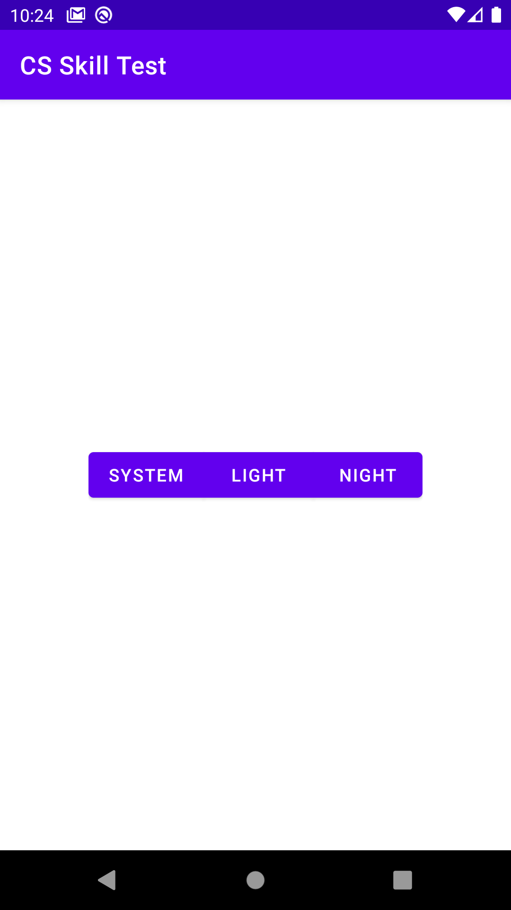
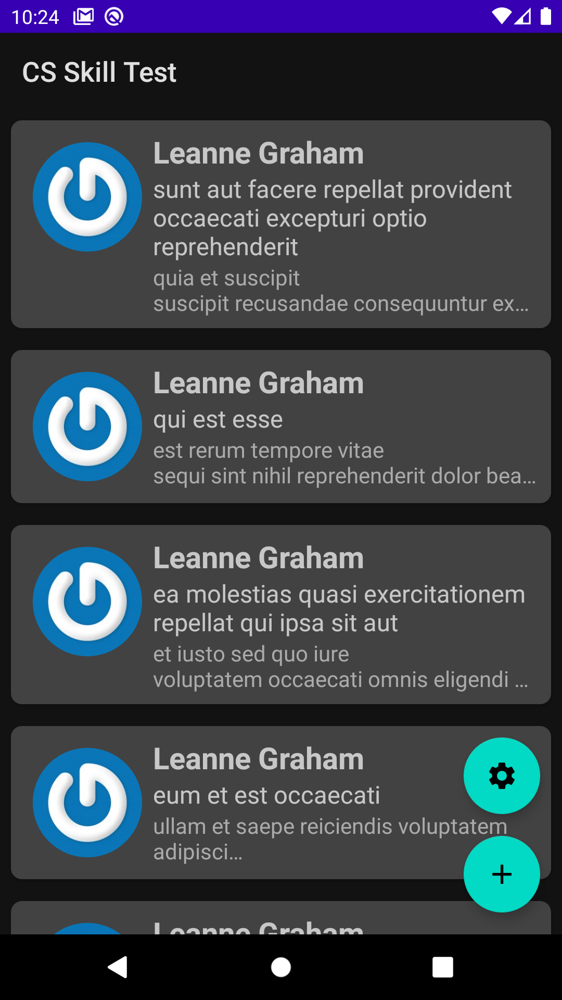
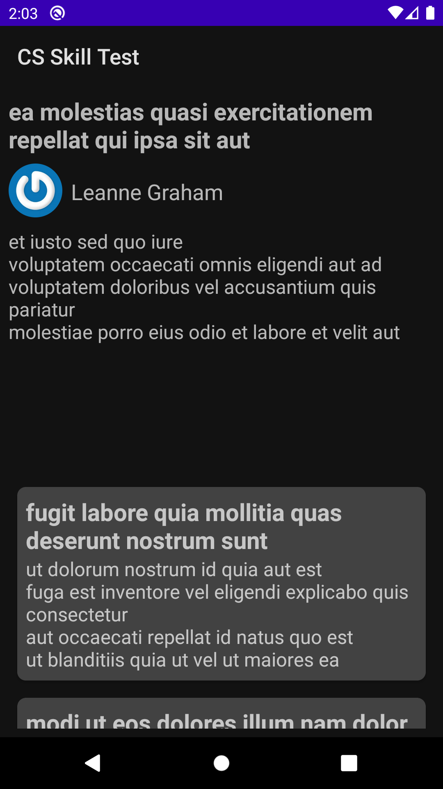
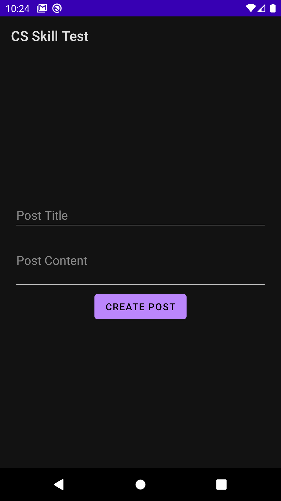
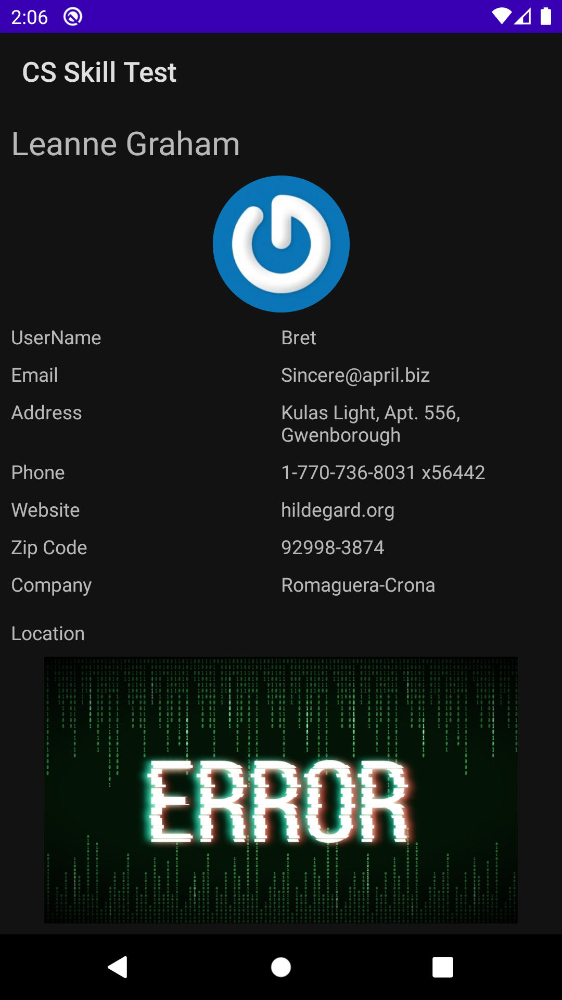
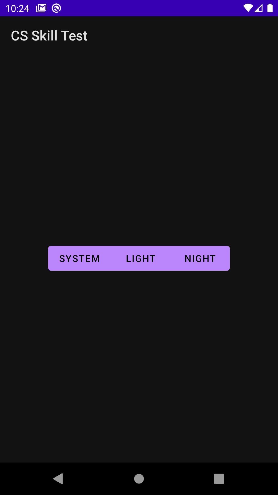

> note

add a google map api key to `local.properties` file before build like below

```
google.map.api-key="your_key"
```

# Light Theme screen shots








# Dark Theme screen shots





